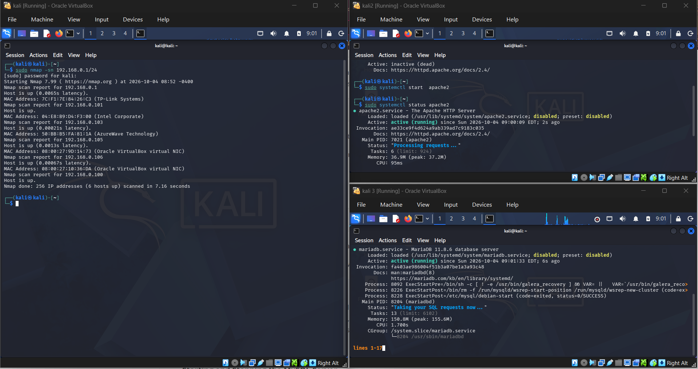
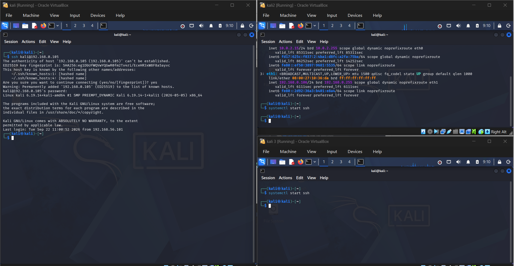
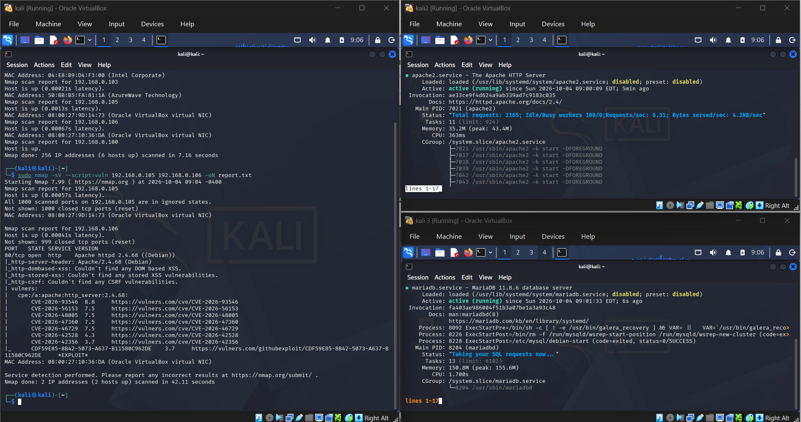
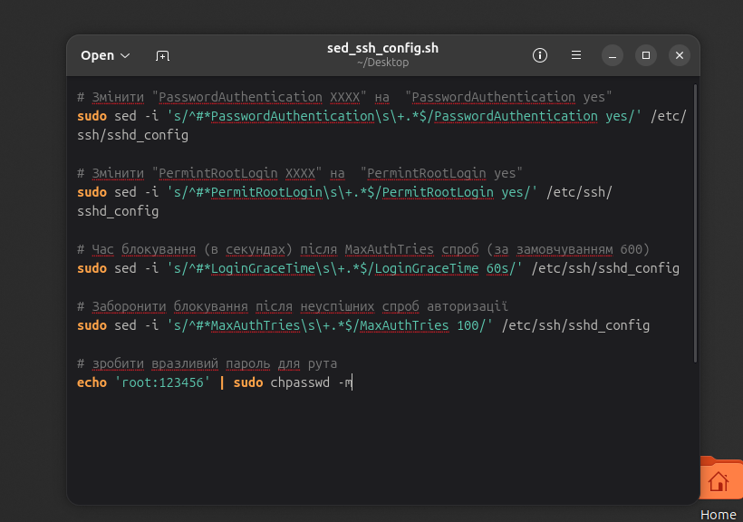
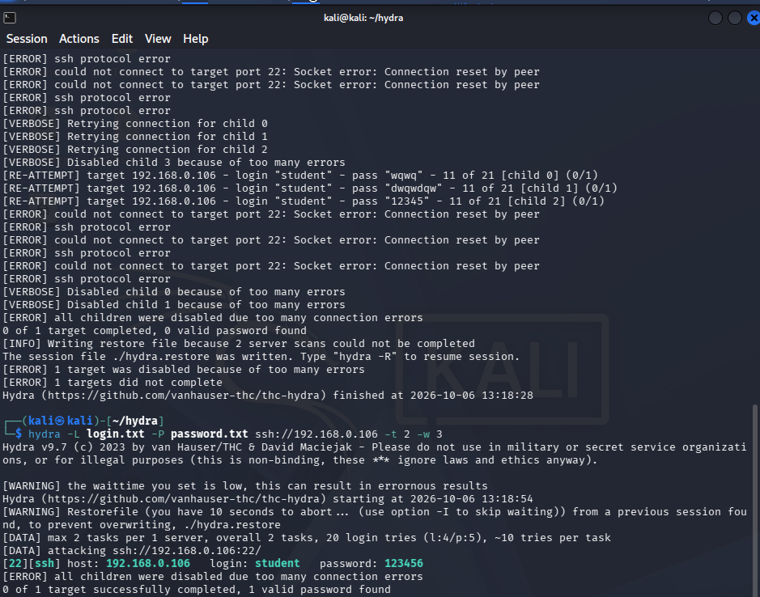

Запустив Kali Linux та два клона Linux, після цього з Kali Linux запустив сканування мережі (192.168.0.1/24) за допомогою команди nmap -sn та виявив всі активні хости. Паралельна закачав і запустив Apache Web i MySQL DB на двох клонах Linux та спробував приєднатися до однієї з мащин за допомгою команди ssh.

Після того як від'єднався від клонованої машини проаналізував вразливості (використовуючи скрипти) двох віртуальних машин за допомогою команди nmap та зберіг результат у документі report.txt 

Пізніше запустив bash-скрипт, який додає варзливість до ssh сервера на клонованій машині Linux Ubuntu.

Далі використовуючи утиліт hydra виконав брутфорс ssh сервера з використанням .txt файлів з наданими логінами і паролями, після виконання команди вдалось знайти логін і пароль до віратльної машини Ubuntu.

