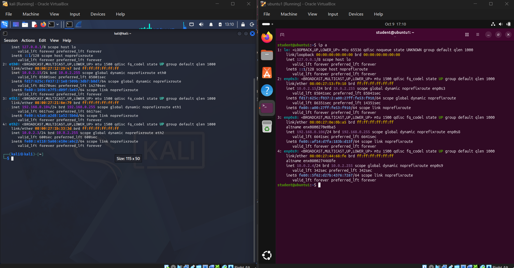
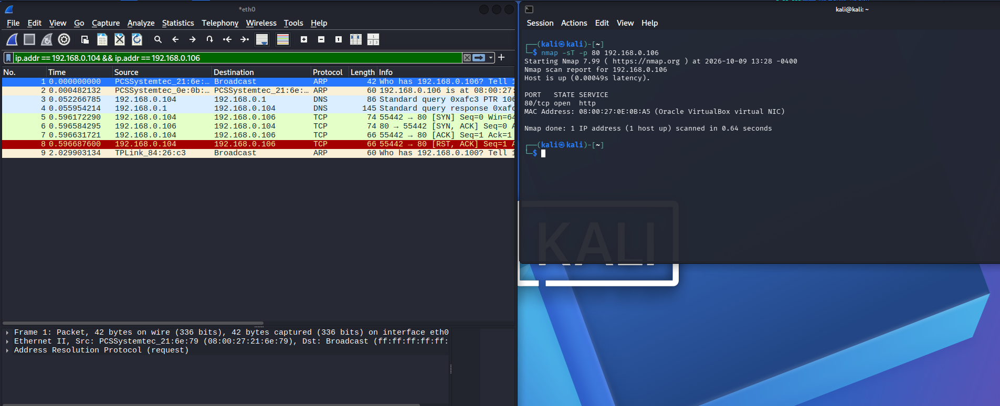
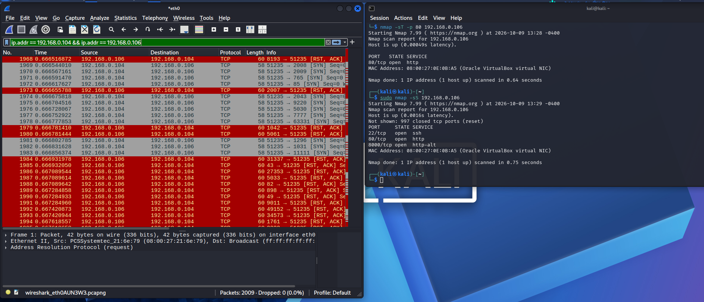
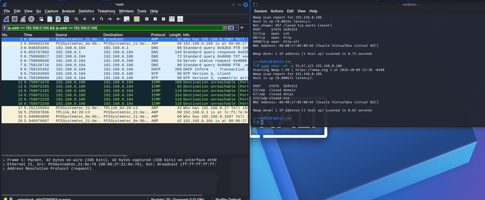
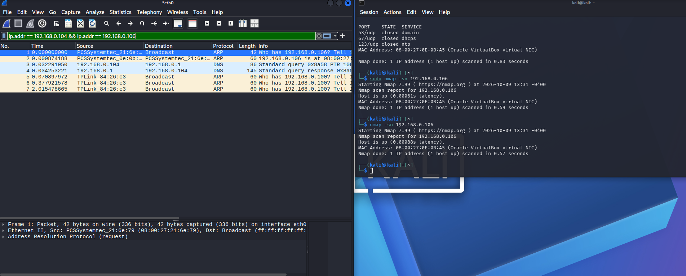
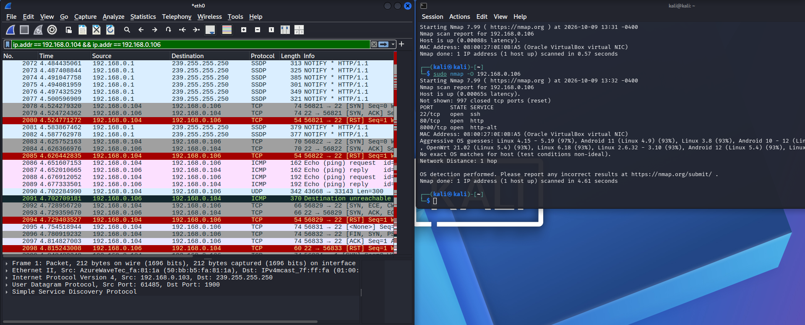
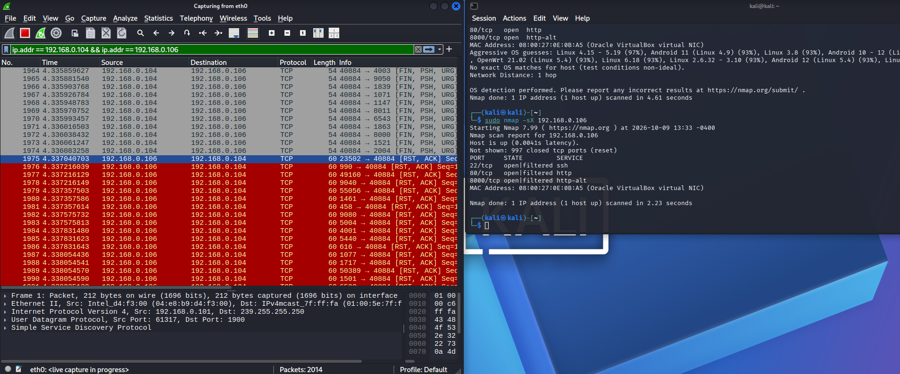
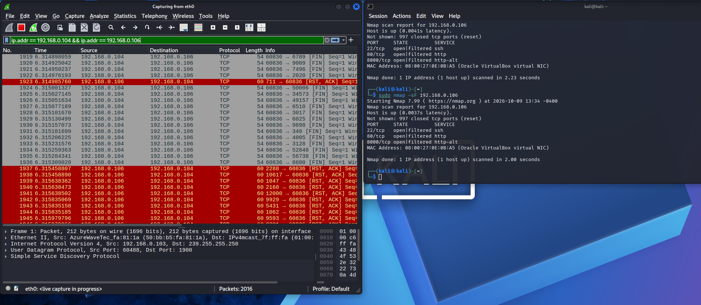
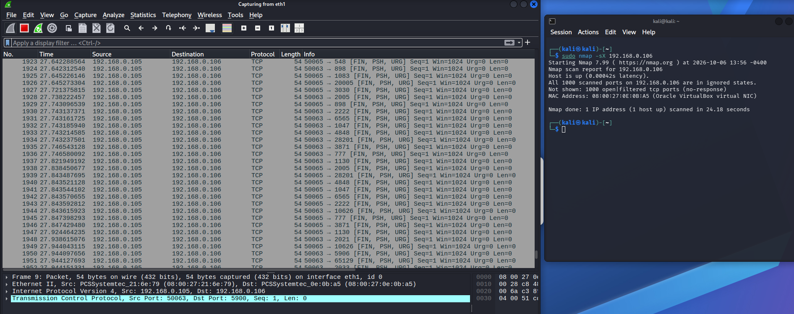
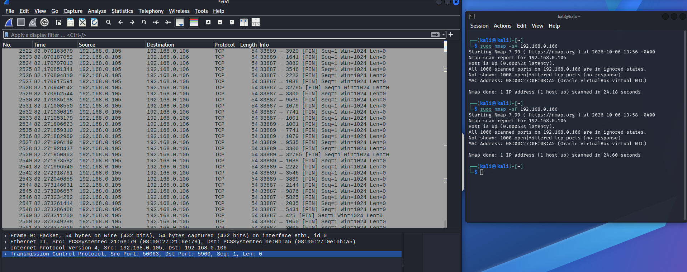

Запустив дві віртуальні машини (Kali/Ubuntu). За допомогою команди (ip a) визначив ip адреси віртуальних машин.

Провів сканування 80 порту через nmap -sT -p 80 192.168.0.106, щоб побачити успішне триетапне рукостискання TCP 3-Way Handshake у Wireshark

Запустив стелс-сканування sudo nmap -sS 192.168.0.106 та повернення пакетів даних у Wireshark RST

Виконав UDP-сканування портів за допомогою sudo nmap -sU -p 53,67,123 192.168.0.106 і зафіксував  ICMP повідомлення про недосяжність портів (так як вони були закриті).

Зробив сканування мережі без перевірки портів через nmap -sn 192.168.0.106  та побачив у Wireshark обмін службовими ARP запитами й відповідями для виявлення хоста

Запустив визначення операційної системи командою sudo nmap -O 192.168.0.106 і відстежив у Wireshark різні пакети.

Виконав сканування sudo nmap -sX 192.168.0.106 та побачив у Wireshark пакети з FIN, PSH та URG

Запустив FIN-сканування через sudo nmap -sF 192.168.0.106 і перевірив у Wireshark, як цільова машина відповідає прапорцями RST, ACK лише на закриті порти.

Зупустив файрвол у Kali Linux та не побачив відповіді від 192.168.0.106

